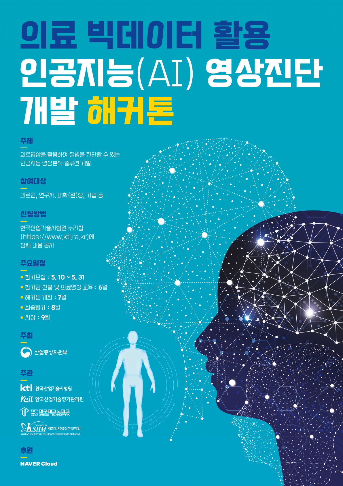

[](LICENSE)

# Introduction
This is a deep learning library for medical imaging by using [TensorFlow 2.x](https://www.tensorflow.org/).
The dataset you can handle are Covid19, Atelectasis, Cap, Pneumothorax, Normal.
But you have to fill the folder corresponding the data with actual data image.
This library achieved rank 1 in detecting Pneumothorax, rank 3 (average) in detecting Cardiomegaly and rank 5 in detecting Breast Cancer in the contest hosted by Ministry of Trade, Industry and Energy in South Korea.
We got awarded Excellence Award (rank 3).
You can find the detailed description with [the presentation file](./images/presentation.pdf).
We are developing multi-classification model and soon upload.



## 1. Installation

You can also install using following command:

```bash
$ git clone https://github.com/KMJ901122/Contest.git
$ cd Contest
$ pip install -r requirements.txt
```

## 2. Usage

### Step 1.
First, you have to fill the folder with datasets.
The list of folders we provide is [covid, atelectasis, cap, pneu, normal]

If you want to add more data, make a folder in the directory 'datasets' with a name corresponding the data and fill the folder with data.
Then, update DATASET in config.py

```python
DATASET=['atelectasis', 'cap', 'covid', 'normal', 'pneumothorax']
->
DATASET=['atelectasis', 'cap', 'covid', 'normal', 'pneumothorax', 'added data']
```

### Step 2.
After then, you should follow the step to preprocess the image data.
```bash
# You must change directory
# Find the directory you installed this library
$ cd Contest\preprocessing
$ python img_preprocessing.py
```
Then the image you stored in the dataset folders will be preprocessed.
You can change crop rate in config.py
```python
COMMON['crop']=[0.03 (crop on left 3%), 0.03 (crop on right 3%), 0.03 (crop on top 3%), 0.03 (crop on down 3%)]
```
and delete original files

### Step 3.
```bash
# You must change directory
# Find the directory you installed this library
$ cd Contest\train
$ python binary_train.py
```
Then the weights will be stored in the weights folders.

if you want to use trained weights and write the results in csv files,
use the following code
```bash
$ cd Contest\utils
$ python create_csv.py pneu # pneu can be replaced with other dataset listed in config.DATASET
```
## 3. Contact
Hyun-Woo, Lee : lhwwoojoo@gmail.com

MJ : know901122@gmail.com
## 4. Citation
```
@misc{TSM,
  author = {Hyun-Woo, Lee, MJ},
  title = {Medical Imaging},
  year = {2021},
  publisher = {GitHub},
  journal = {GitHub repository},
  howpublished = {\url{https://github.com/KMJ901122/Contest.git}}
}
```
